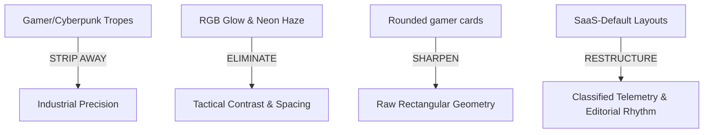

# REEL ENGINE — Classified Cinematic Operating System Redesign Plan

This document details the shift in art direction for **REEL ENGINE** from its previous tech-glow aesthetic into a **classified cinematic operating system** with the raw precision of BMW M industrial engineering and Apple Pro / DaVinci Resolve workstation aesthetics.

---

## 1. Cinematic Art Direction & Color System Critique

### What We Are Stripping Away
*   **No more atmospheric blue glows or floating soft orbs.** Floating neon haze is replaced by rigid, functional, localized shadows and tight surface highlights.
*   **No more generic border outlines.** Outlines are reduced by 80% to focus on pure structural layouts, using tone-on-tone separations.
*   **No more large border-radii.** We are moving from high-radius smooth curves (`16px`/`24px`) to tight industrial chamfers or absolute **zero-radius sharp corners** (`2px` to `4px` maximum).

### The New Architecture: Base Surface & Accent
*   **Primary Accent: Khaki Orange (`#F2B759`)** — Representing active telemetry, high-end mechanical instrument dials, and warning markers on pro camera gear.
*   **Base Surface: Dark Slate Green (`#0A4A3C` / `#051b16`)** — Behaved like solid anodized military casing, heavily desaturated at base, creating a dark slate green-black texture.
*   **Typography: Warm White (`#E5E5DD`)** — Softening pure digital white to feel like analog labels, industrial machine engravings, and classic 35mm title cards.

---

## 2. Structural & Spacing Specifications

| Attribute | Old System | New System (Classified / Tactical) |
|---|---|---|
| **Border Radius** | `10px` to `24px` | `0px` to `4px` max (Hard industrial slate corners) |
| **Grid Lines** | Subtle gradients | Pure sharp `1px` structural hairlines with tactical intervals |
| **Pacing & Spacing** | Snug, SaaS-typical padding | Wide-breath, editorial layout spacing with dense metadata blocks |
| **Interactive Glow** | Bright halo shadows | Localized warm high-contrast highlights (Khaki Orange focus states) |

---

## 3. Typography Hierarchy

*   **Titles / Cinematic Headlines**: Massive, heavy-weight editorial headers. Pure uppercase configurations with tight character spacing (`tracking-tighter` or `tracking-widest` for technical labels).
*   **Monospace Data Layer**: JetBrains Mono for system metrics, FFmpeg flags, crop telemetry, and voice synthesis decibel logs.
*   **Body Copy**: Inter, highly restrained, using low contrast to recede into background unless hovered.

---

## 4. Systematic Redesign Roadmap

### Phase 1: Global Theme & Core Token Alignment
- **File**: `web/src/app/globals.css`
- **Actions**:
  - Overwrite TW4 theme tokens to use the Slate Green (`#0A4A3C` desaturated to `#051814`) and Khaki Orange (`#F2B759`).
  - Set global background to desaturated dark slate green-black (`#030f0d`).
  - Strip down `.glass-card` and `.glass-heavy` components to remove glow parameters.
  - Implement tight industrial border variables (`--radius-sm: 2px`, `--radius-md: 4px`).

### Phase 2: Landing Page Overhaul
- **Files**: `web/src/components/landing/*` and `web/src/app/page.tsx`
- **Actions**:
  - **Navigation**: Restructure into a flat, slim technical utility bar with zero rounded corners and high-contrast typography.
  - **HeroSection**: Remove glowing concentric rings and active glowing particles. Replace with horizontal/vertical film strips, strict rectangular blocks, raw telemetry data (FFmpeg command traces, render settings), and a monumental uppercase headline block.
  - **Showcase & Features**: Revamp grid styles to use hard edges and pure `#F2B759` border highlights only on interactive focus. Remove floating cards; replace with solid, heavy dark-slate containers.
  - **Workflow & Stats**: Adapt into an elegant technical manual sequence.

### Phase 3: Studio Dashboard Overhaul
- **Files**: `web/src/components/studio/*` and `web/src/app/studio/page.tsx`
- **Actions**:
  - Transform workspace to look like high-end post-production workstation (DaVinci Resolve / Premiere Pro color panel).
  - Use clean grids, strict mechanical divisions, and desaturated slate gray-greens with Khaki Orange dials and telemetry counters.
  - Re-engineer "Generate" buttons to resemble heavy hardware switches.
